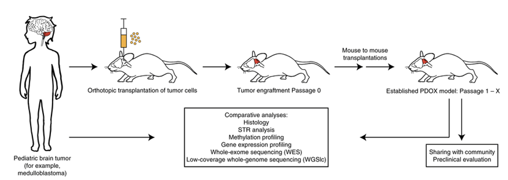

# snRNASeq_Brain_Tumor_Data_Analysis

Analysis of single nucleus-RNAseq Brain Dataset - Stefan Pfister


## The analysis pipeline

The analysis pipeline is explained below. The scripts are located under ```bin``` folder. After running each script, the relevant plots are created under ```plots``` folder. The ```out_data``` folder mentioned below is available in the following link:

https://drive.google.com/drive/folders/1fKj4oA9kTr7WQDy0lTDm6KhA5pKx0Dd7?usp=sharing

The ```out_data``` folder should be located under ```data``` folder to reproduce the results. To order of scripts and brief explanations are available below:

- ```qc_preprocess``` applies preprocessing and filtering steps on each sample individually. The raw data (count matrices) should be located under data folder as ```data/b06x-g/G703/eblanco/projects/Aniello_ITCC-P4/results/count_matrices_to_share/snRNAseq/6.1.0```. This scripts saves the resulting AnnData objects under ```data/out_data``` folder (e.g. ```data/out_data/sample01_B062_007+pdx01-x_human_filtered.h5ad```). The script first seperates PDX samples into two as human and mouse samples and applies QC and filtering on the samples. The script can be run as follows:

```
    python qc_preprocess.py
```

- ```merge.py``` merges the samples coming from mice (PDX+control) and human samples(PDX-tumor + tumor). It takes three arguments: *__(i)__* ```-i or --input_dir``` represents input directory containing the preprocessed AnnData object , *__(ii)__* ```-o or --output_dir``` argument representes the directory for the merged AnnData objects and *__(iii)__* ```-st or --sample_type``` argument represents the samples to be merged (i.e., human or mouse). Once the script is run the ```human_merged.h5ad``` or ```mouse_merged.h5ad``` files are created under the specified output folder (in this case ```../data/out_data```). This script can be run as follows:
```
    # mouse_merged.h5ad created
    python merge.py -i ../data/out_data -o ../data/out_data  -st mouse 
    # human_merged.h5ad created
    python merge.py -i ../data/out_data -o ../data/out_data  -st human # for human
```

- ```integrate.py``` works similar to the ```merge.py```. The arguments are the same except that ```-i or --input_dir``` argument takes the path of the merged sample of interest. ```human_integrated.h5ad``` or ```mouse_integrated.h5ad``` files are created under the specified output folder (in this case ```../data/out_data```). This script can be run as follows:
```
    python integrate.py -i ../data/out_data/mouse_merged.h5ad -o ../data/out_data -st mouse
    python integrate.py -i ../data/out_data/human_merged.h5ad -o ../data/out_data -st human
```

- For ```cluster_annotate.py```, the arguments are the same except that ```-i or --input_dir``` argument takes the path of the integrated sample  file of interest. ```human_integrated.h5ad``` or ```mouse_integrated.h5ad``` files are updated/created under the specified output folder (in this case ```../data/out_data```). It performs clustering based on different resolution parameters and perform cell type annotation using the marker genes. The DEG for each cluster are also computed and plotted. The csv files are also created under ```data/out_data``` folder for each clustering run (e.g.```human_deg_leiden_res_0.1.csv```). Here, the ```group``` column represents the cluster number. The cluster keys are labeled as ```leiden_<resolution>``` in AnnData objects. This script can be run as follows:
```
    python cluster_annotate.py -i ../data/out_data/mouse_integrated.h5ad -o ../data/out_data -st mouse
    python cluster_annotate.py -i ../data/out_data/human_integrated.h5ad -o ../data/out_data -st human
```

- ```downstream_analysis.py``` has the same parameters as above. This scripts runs PROGENy for pathway activity estimation.```human_integrated_progeny_act.h5ad``` or ```mouse_integrated_progeny_act.h5ad``` files are created under the specified output folder (in this case ```../data/out_data```). In these AnnData objects, columns represent 14 different pathways instead of genes. The relevant plots are available under ```plots/downstream``` folder. This script can be run as follows:
```
    python downstream_analysis.py -i ../data/out_data/mouse_integrated.h5ad -o ../data/out_data -st mouse
    python downstream_analysis.py -i ../data/out_data/human_integrated.h5ad -o ../data/out_data -st human
```